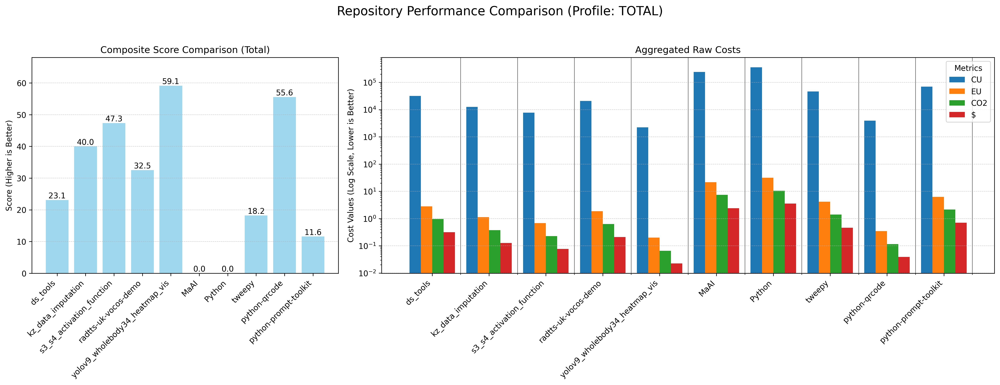

# Complexity Cost Profiler

CostComplexityProfiler: Advanced Algorithmic Complexity Assessment Model with Unified Composite Score.
A sophisticated static analysis tool designed to evaluate the "cost" of software projects across multiple dimensions beyond traditional time complexity.

## The Core Problem

Traditional algorithm analysis, often limited to Big O notation, is abstract and fails to capture critical real-world operational costs. In modern software development, factors like energy consumption (for mobile/IoT), cloud infrastructure expenses, and environmental impact are crucial considerations.

The **Complexity Cost Profiler** addresses this gap by providing a multi-faceted cost assessment, allowing developers and managers to make more informed decisions based on a holistic view of software efficiency.

## Purpose 

This enhanced prototype implements a Python utility for evaluating computational "cost" of algorithms considering processor architectural features (CPU/ARM/GPU), energy consumption metrics and the ability to translate costs into monetary equivalent. Now includes a unified composite score based on scaled normalization of 4 main metrics and 5 profiles.

## Key Features

-   **Multi-Dimensional Analysis**: Evaluates code based on four key metrics:
    -   **CU (Computational Units)**: Abstract measure of computational effort.
    -   **EU (Energy Units)**: Estimated energy consumption.
    -   **CO2 (CO2 Units)**: Estimated carbon footprint.
    -   **$ (Monetary Units)**: Estimated monetary cost for execution (e.g., in a cloud environment).
-   **Composite Score**: Combines the four core metrics into a single, unified score (0-100) for easy, high-level comparison. A higher score indicates better overall efficiency.
-   **Analysis Profiles**: Applies different weighting schemes to the metrics, allowing for cost assessment tailored to specific deployment targets:
    -   `HPC`: Prioritizes computational performance (CU).
    -   `MOBILE`: Prioritizes energy efficiency (EU).
    -   `COMMERCIAL`: Balances performance with monetary cost ($).
    -   `RESEARCH`: Focuses on performance while being mindful of environmental impact.
    -   `DEFAULT`: A balanced profile for general use.
-   **Automated Repository Analysis**: Can clone one or more Git repositories, automatically discover source files (`.py`, `.ll`, `.ptx`), and perform a comprehensive analysis.
-   **Extensible Cost Models**: Instruction costs for different architectures (e.g., `x86_64`) are defined in simple JSON files, making the system easy to extend and calibrate.
-   **Rich Visualizations**: Generates insightful charts to visually compare the efficiency of different algorithms or repositories.

## How It Works

The profiler follows a systematic pipeline for each analysis:

1.  **Code Acquisition**: Clones a Git repository or targets local source files.
2.  **Disassembly**: Statically analyzes source files, breaking down functions and methods into fundamental instructions (e.g., Python bytecode).
3.  **Cost Aggregation**: For each instruction, it looks up the corresponding costs (CU, EU, CO2, $) from an architecture-specific JSON model. These costs are summed up for the entire codebase.
4.  **Normalization & Scoring**: The aggregated raw costs are normalized to a 0-100 scale. Using the weights from a selected **Profile**, it calculates the final **Composite Score**.
5.  **Reporting**: Generates detailed summary tables and comparison charts to present the findings.

## Formulas: Computational Cost Analysis Framework

### Variable Definitions

Let:
- `op_i`: number of instructions of type `i`
- `w_i`: weight (cost) of instruction `i` in CU
- `f_e(i)`: energy consumption of instruction `i` (in Joules)
- `f_c(i)`: CO₂ footprint (kg CO₂)
- `f_d(i)`: monetary cost of executing instruction `i` ($)

### Total Cost Calculations

#### Computational Units
```
COST_total = ∑(op_i × w_i)       [in CU]
```

#### Energy Consumption
```
ENERGY_total = ∑(op_i × f_e(i))  [in Joules]
```

#### Carbon Footprint
```
CO2_total = ∑(op_i × f_c(i))     [in kg CO₂]
```

#### Monetary Cost
```
MONEY_total = ∑(op_i × f_d(i))   [in $ or €]
```

### Composite Score Formula

Let `S_cu`, `S_eu`, `S_co2`, `S_$` be normalized scores (0-100) for each metric.


Then:
```
COMPOSITE_SCORE = α×S_cu + β×S_eu + γ×S_co2 + δ×S_$
```

**Constraint:**
```
α + β + γ + δ = 1 (configurable weights)
```

---

*Note: All weights (α, β, γ, δ) are user-configurable to prioritize different optimization objectives.*

## Usage Example

The tool is designed to be run from a script. The main workflow involves defining a list of target repositories and launching the analysis loop.

```python
# --- Main execution loop for multiple repositories ---
from IPython.display import display, Image # For displaying charts in notebooks
import platform
import os
import subprocess
import shutil

import utils as u


###########################################
####            main body              ####
###########################################

print("\n"*2 + '#'*150 + "\n")
print("\t"*6 + "\033[1mCOMPREHENSIVE REPOSITORY ANALYSIS\033[0m")

# 1. List of URL-addresses of  repos
REPO_URLS = [
    "https://github.com/s-kav/ds_tools.git",
    "https://github.com/s-kav/kz_data_imputation.git",
    "https://github.com/s-kav/s3_s4_activation_function.git",
    "https://github.com/egorsmkv/radtts-uk-vocos-demo.git",
    "https://github.com/PINTO0309/yolov9_wholebody34_heatmap_vis.git",
    "https://github.com/MaAI-Kyoto/MaAI.git",
    "https://github.com/TheAlgorithms/Python.git",
    "https://github.com/tweepy/tweepy.git",
    "https://github.com/lincolnloop/python-qrcode.git",
    "https://github.com/prompt-toolkit/python-prompt-toolkit.git"
]
# Important! All these repos are opened! Not for advertising!

detected_arch = platform.machine().lower()
all_repo_data = {}

# Analyze each repository and store its data
for repo_url in REPO_URLS:
    local_repo_path = repo_url.split('/')[-1].replace('.git', '')

    if not os.path.isdir(local_repo_path):
        subprocess.run(['git', 'clone', repo_url], capture_output=True, text=True)

    repository_df = u.analyze_repository(
        repo_path=local_repo_path,
        detected_arch=detected_arch,
        verbose=False 
    )
    
    if not repository_df.empty:
        repository_df.set_index('PROFILE NAME', inplace=True)
        all_repo_data[local_repo_path] = repository_df # Store the result
    
        print(f"\n[Analysis] Aggregated assessment for repository: '{local_repo_path}'")
        display(repository_df.style.format({
            'COMPOSITE_SCORE': '{:.2f}',
            'CU': '{:,.0f}',
            'EU': '{:,.4f}',
            'CO2': '{:,.4f}',
            '$': '{:,.4f}',
        }))
```

## Example Output

The analysis of each repository produces a detailed table showing its performance from the perspective of each profile.

**[Analysis] Aggregated assessment for repository: 'kz_data_imputation'**
| PROFILE NAME | File Type | Function Name | COMPOSITE_SCORE | SCORE_GRADE | CU | EU | CO2 | $ |
| :--- | :--- | :--- | :--- | :--- | :--- | :--- | :--- | :--- |
| RESEARCH | Python (12) | 89 | 42.23 | D | 12,607 | 1.1194 | 0.3763 | 0.1261 |
| COMMERCIAL | Python (12) | 89 | 30.24 | F | 12,607 | 1.1194 | 0.3763 | 0.1261 |
| MOBILE | Python (12) | 89 | 53.76 | C- | 12,607 | 1.1194 | 0.3763 | 0.1261 |
| HPC | Python (12) | 89 | 36.00 | F | 12,607 | 1.1194 | 0.3763 | 0.1261 |
| DEFAULT | Python (12) | 89 | 37.79 | F | 12,607 | 1.1194 | 0.3763 | 0.1261 |
| TOTAL | All Files (12) | 89 | 40.00 | D | 12,607 | 1.1194 | 0.3763 | 0.1261 |

Finally, a summary chart is generated to compare all analyzed repositories at a glance.

```python
if all_repo_data:
    print("\n[Chart] Generating summary comparison chart for all repositories...")
    
    summary_chart_filepath = os.path.join(u.DEFAULT_REPORT_DIR, "repository_comparison_summary.png")
    
    # Call the new function to create the comparison chart.
    # You can change the profile to plot, e.g., "RESEARCH", "COMMERCIAL", etc.
    u.create_repository_comparison_chart(
        repo_data=all_repo_data,
        output_filepath=summary_chart_filepath,
        profile_to_plot="TOTAL" # This determines which row to use from each DataFrame     
    )
else:
    print("\n[Info] No data was collected from repositories, skipping chart generation.")
```

**[Chart] Displaying generated chart...**



## Future Roadmap

-   **CI/CD Integration**: Develop a GitHub Action to run the profiler on pull requests and report on potential efficiency regressions.
-   **Expanded Language Support**: Add analyzers for other languages like C++, Java, and JavaScript.
-   **Hardware-Based Calibration**: Create tools to generate more accurate cost models by profiling instruction costs on real hardware.
-   **Web Dashboard**: Build a web-based UI to visualize historical analysis data and track project efficiency over time.
