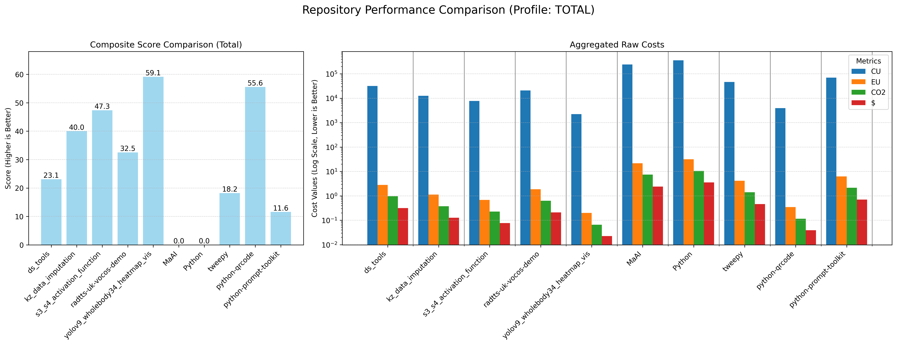
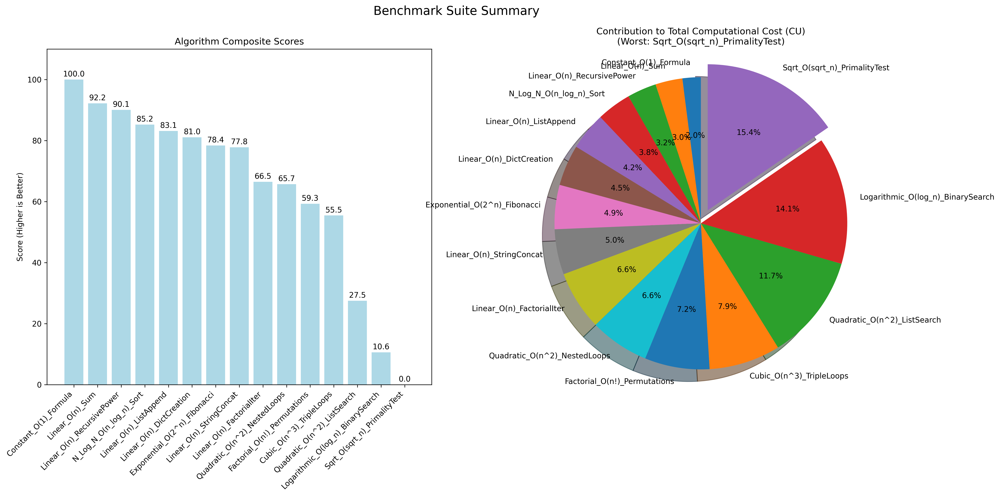
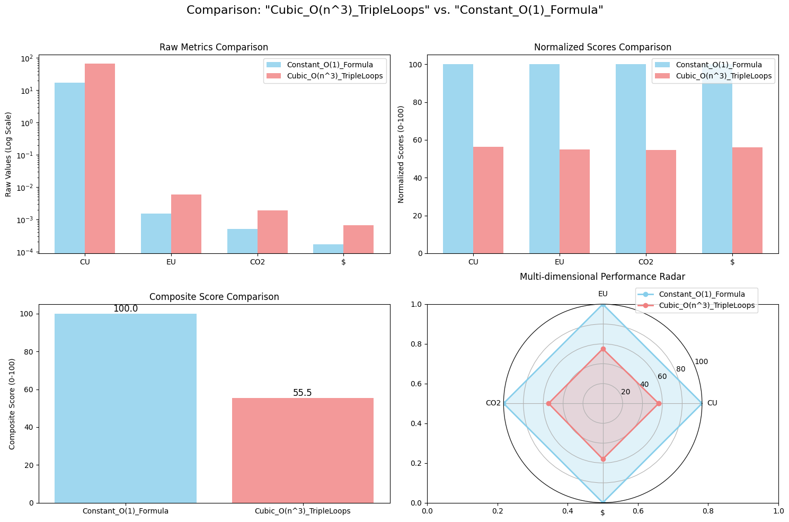

# Complexity Cost Profiler

CostComplexityProfiler: Advanced Algorithmic Complexity Assessment Model with Unified Composite Score and Mixed-Precision HPC Analysis.
A sophisticated static analysis tool that evaluates the "cost" of software projects across multiple dimensions: computational effort, energy consumption, carbon footprint, and monetary cost — now extended with floating-point precision-accuracy tradeoff analysis and HPC library benchmarking.

## The Core Problem

Traditional algorithm analysis, often limited to Big O notation, is abstract and fails to capture critical real-world operational costs. In modern HPC and machine-learning workloads, the choice of floating-point precision format (FP64, FP32, BF16, FP16, INT8) dramatically affects throughput, energy use, and numerical accuracy — yet most profilers treat all operations as equivalent.

The **Complexity Cost Profiler** addresses this gap by providing a multi-faceted cost assessment that includes precision-aware hardware models, enabling developers and scientists to make data-driven decisions on the cost–accuracy–performance surface.

## Purpose 

This enhanced prototype implements a Python utility for evaluating computational "cost" of algorithms considering processor architectural features (CPU/ARM/GPU), energy consumption metrics and the ability to translate costs into monetary equivalent. Now includes a unified composite score based on scaled normalization of 4 main metrics and 5 profiles.

## Key Features

### Core Metrics (CU / EU / CO2 / $)
 
| Metric | Description |
|--------|-------------|
| **CU** | Computational Units — abstract measure of computational effort |
| **EU** | Energy Units — estimated energy consumption (Joules) |
| **CO2** | Estimated carbon footprint (kg CO₂) |
| **$ (Monetary Units)** | Estimated monetary cost (cloud billing) |

### Composite Score

Combines the four core metrics into a single, unified score (0-100) for easy, high-level comparison. A higher score indicates better overall efficiency.

### Analysis Profiles

Applies different weighting schemes to the metrics, allowing for cost assessment tailored to specific deployment targets.
 
| Profile | Focus |
|---------|-------|
| `HPC` | Maximum (Prioritizes) computational throughput (CU weight 0.50) |
| `MIXED_PRECISION` | Optimal precision selection — FP64/FP32/FP16/INT8 (CU 0.40, EU 0.35) |
| `MOBILE` | Energy efficiency and battery life (EU weight 0.50) |
| `COMMERCIAL` | Cost–performance balance with monetary cost ($ weight 0.30) |
| `RESEARCH` | Performance with environmental awareness |
| `DEFAULT` | Balanced general-purpose profile |

-   **Automated Repository Analysis**: Can clone one or more Git repositories, automatically discover source files (`.py`, `.ll`, `.ptx`), and perform a comprehensive analysis.
-   **Extensible Cost Models**: Instruction costs for different architectures (e.g., `x86_64`) are defined in simple JSON files, making the system easy to extend and calibrate.
-   **Rich Visualizations**: Generates insightful charts to visually compare the efficiency of different algorithms or repositories.

### Mixed-Precision Support (NEW)
 
- Per-precision cost multipliers based on NVIDIA A100 SXM4 throughput data
- IEEE 754 accuracy specs: machine epsilon, max relative error, dynamic range
- Precision-accuracy tradeoff analysis: speedup, energy savings, accuracy loss factor
- Task-specific precision recommendations (12 task types)
- PTX instruction auto-detection of precision suffixes (`MUL.F16`, `FMA.F64`, …)
### HPC Library Integration (NEW)
 
- Benchmarks NumPy, SciPy, and CuPy (optional GPU) across operations:
  `matrix_multiply`, `fft`, `linear_solve`, `svd`, `norm`
- Measures wall-clock time → converts to CU/EU/CO2/$ via hardware model
- CPU baseline: Intel Xeon Platinum 8380 (270 W, 2.4 TFLOP/s FP64)
- GPU baseline: NVIDIA A100 SXM4 (400 W, 9.7 TFLOP/s FP64)
- Composite scoring and library recommendation per operation
### Publication-Quality Figures (NEW)
 
Script `examples/publication_figures.py` generates 5 figures (PDF + PNG, 300 dpi) - see https://github.com/s-kav/complexity_cost_profiler/tree/main/figures:
 
| Figure | Content |
|--------|---------|
| Fig. 1 | Pareto front: throughput speedup vs. accuracy loss (log–log) |
| Fig. 2 | Relative resource savings by precision format (grouped bar chart) |
| Fig. 3 | Composite efficiency score by precision format |
| Fig. 4 | HPC library benchmark: elapsed time vs. problem size |
| Fig. 5 | Task–precision compatibility heatmap |
 
---
 
## Supported Precision Formats
 
| Format | Bits | Machine ε | Dynamic Range | Throughput vs FP64 | Typical Use |
|--------|------|-----------|---------------|--------------------|-------------|
| FP64 | 64 | 2.22×10⁻¹⁶ | 307 decades | 1× | Scientific computing, CFD, finance |
| FP32 | 32 | 1.19×10⁻⁷ | 38 decades | 2× | General HPC, deep learning, OpenFOAM |
| BF16 | 16 | 7.81×10⁻³ | 38 decades | 32× | DL training (preferred over FP16) |
| FP16 | 16 | 9.77×10⁻⁴ | 4 decades | 32× | NN training/inference, mixed precision |
| INT8 | 8 | — | 2.3 decades | 64× | Post-training quantization, inference |
 
---

## How It Works

The profiler follows a systematic pipeline for each analysis:

1.  **Code Acquisition**: Clones a Git repository or targets local source files.
2.  **Disassembly**: Statically analyzes source files, breaking down functions and methods into fundamental instructions (e.g., Python bytecode).
3.  **Cost Aggregation**: For each instruction, it looks up the corresponding costs (CU, EU, CO2, $) from an architecture-specific JSON model. These costs are summed up for the entire codebase.
4.  **Normalization & Scoring**: The aggregated raw costs are normalized to a 0-100 scale. Using the weights from a selected **Profile**, it calculates the final **Composite Score**.
5.  **Reporting**: Generates detailed summary tables and comparison charts to present the findings.

## Formulas: Computational Cost Analysis Framework

### Variable Definitions

Let:
- `op_i`: number of instructions of type `i`
- `w_i`: weight (cost) of instruction `i` in CU
- `f_e(i)`: energy consumption of instruction `i` (in Joules)
- `f_c(i)`: CO₂ footprint (kg CO₂)
- `f_d(i)`: monetary cost of executing instruction `i` ($)

### Total Cost Calculations

#### Computational Units
```
COST_total = ∑(op_i × w_i)       [CU]
```

#### Energy Consumption
```
ENERGY_total = ∑(op_i × f_e(i))  [Joules]
```

#### Carbon Footprint
```
CO2_total = ∑(op_i × f_c(i))     [kg CO₂]
```

#### Monetary Cost
```
MONEY_total = ∑(op_i × f_d(i))   [$ or €]
```

### Precision Scaling
 
```
CU(p)  = CU(FP64)  × cu_multiplier(p)
EU(p)  = EU(FP64)  × eu_multiplier(p)
CO2(p) = CO2(FP64) × co2_multiplier(p)
$(p)   = $(FP64)   × cost_multiplier(p)
```

### Composite Score Formula

Let `S_cu`, `S_eu`, `S_co2`, `S_$` be normalized scores (0-100) for each metric.


Then:
```
COMPOSITE_SCORE = α×S_cu + β×S_eu + γ×S_co2 + δ×S_$

```

**Constraint:**
```
α + β + γ + δ = 1 (configurable weights)
```

Weights `α, β, γ, δ` are profile-dependent and loaded from `cost_models/config_weights.json`.
---

*Note: All weights (α, β, γ, δ) are user-configurable to prioritize different optimization objectives.*

## Repository Structure
 
```
complexity_cost_profiler/
├── src/
│   ├── enhanced_cost_analyzer.py      # Main analyzer: Python / LLVM IR / PTX
│   ├── instruction_cost_model.py      # Per-instruction cost lookup + precision multipliers
│   ├── composite_score_calculator.py  # Composite scoring with profile weights
│   ├── precision_accuracy_model.py    # NEW: FP64/FP32/BF16/FP16/INT8 tradeoff model
│   ├── hpc_library_integration.py     # NEW: NumPy / SciPy / CuPy benchmarking
│   ├── benchmark_algorithms.py
│   ├── model_validator.py
│   └── utils.py
├── cost_models/
│   ├── config_weights.json            # Profile weight definitions (incl. MIXED_PRECISION)
│   ├── precision_profiles.json        # NEW: IEEE 754 specs + task accuracy requirements
│   ├── gpu_ptx_instr_costs.json       # Extended: per-precision PTX instruction costs
│   ├── x86_64_instr_costs.json
│   └── arm_instr_costs.json
├── examples/
│   ├── hpc_precision_demo.py          # NEW: 6-section mixed-precision demo
│   ├── publication_figures.py         # NEW: Publication-quality figure generator
│   └── matrixMul_kernel_32.ptx        # Example PTX kernel
├── figures/                           # NEW: Generated PDF/PNG figures
├── research_notebooks/
│   └── complexity_cost_profiler_v*.ipynb
└── results/
```
 
---

## Installation
 
```bash
uv add numpy scipy pandas matplotlib requests cupy-cuda12x jupyter ipykernel scikit-learn
```
 
> `cupy-cuda12x` requires an NVIDIA GPU with CUDA 12. Omit if running CPU-only.
 
---

### Run the HPC / Mixed-Precision Demo
 
```bash
PYTHONPATH=src python examples/hpc_precision_demo.py
```
 
Produces six output sections:
1. Precision-accuracy tradeoff table (all formats vs FP64)
2. Per-precision cost analysis of a dense matrix–vector product
3. Pairwise precision comparisons with warnings
4. Task-specific precision recommendations
5. HPC library benchmark (NumPy / SciPy / CuPy)
6. PTX precision analysis (if `examples/matrixMul_kernel_32.ptx` present)
### Generate Publication Figures
 
```bash
PYTHONPATH=src python examples/publication_figures.py
# Output: figures/fig{1..5}.pdf  and  figures/fig{1..5}.png
```
 
### Precision-Aware Function Analysis
 
```python
from enhanced_cost_analyzer import EnhancedCostAnalyzer
from precision_accuracy_model import SUPPORTED_PRECISIONS
 
analyzer = EnhancedCostAnalyzer(arch="x86_64", profile="MIXED_PRECISION")
 
def my_hpc_kernel():
    ...
 
# Compare all precision formats
comparison = analyzer.compare_precisions(my_hpc_kernel, precisions=SUPPORTED_PRECISIONS)
print(comparison["best_for_performance"])   # e.g. "INT8"
print(comparison["best_balanced"])          # e.g. "FP32"
```
 
### Task-Specific Precision Recommendation
 
```python
from precision_accuracy_model import PrecisionAccuracyModel
 
model = PrecisionAccuracyModel()
base  = {"CU": 500.0, "EU": 5.0, "CO2": 0.000384, "$": 0.002}
 
candidates = model.recommend_precision(base, task_type="iterative_solver")
for prec, adj in sorted(candidates.items(), key=lambda kv: kv[1].adjusted_metrics["CU"]):
    print(f"{prec}: CU={adj.adjusted_metrics['CU']:.2f}  ε={adj.accuracy_info['machine_epsilon']:.2e}")
```
 
### HPC Library Benchmarking
 
```python
from hpc_library_integration import HPCLibraryProfiler
 
profiler = HPCLibraryProfiler(sizes=[64, 128, 256], precisions=["FP64", "FP32"], repeats=5)
results  = profiler.profile_all(operations=["matrix_multiply", "fft"])
 
best = profiler.recommend_library(operation="matrix_multiply", size=128)
print(f"Best: {best['library']} / {best['precision']}  score={best['composite_score']:.1f}")
```
 
### Multi-Repository Analysis (Notebook)
 
```python
from enhanced_cost_analyzer import EnhancedCostAnalyzer
import utils as u, platform
 
analyzer = EnhancedCostAnalyzer(arch=platform.machine().lower(), profile="RESEARCH")
 
REPO_URLS = [
    "https://github.com/s-kav/ds_tools.git",
    # ...
]
 
for repo_url in REPO_URLS:
    repo_path = repo_url.split("/")[-1].replace(".git", "")
    df = u.analyze_repository(repo_path=repo_path, detected_arch=platform.machine().lower())
    print(df)
```

---

### Repository Assessment
 
| PROFILE NAME | COMPOSITE_SCORE | SCORE_GRADE | CU | EU | CO2 | $ |
|:---|:---|:---|:---|:---|:---|:---|
| RESEARCH | 42.23 | D | 12,607 | 1.1194 | 0.3763 | 0.1261 |
| MOBILE | 53.76 | C- | 12,607 | 1.1194 | 0.3763 | 0.1261 |
| HPC | 36.00 | F | 12,607 | 1.1194 | 0.3763 | 0.1261 |
 
---

 
## Example Output
 
### Precision-Accuracy Tradeoff Table
 
```
Precision   Bits   Speedup  Enrg saved%  CO2 saved%  Acc loss ×   Machine ε
FP64          64      1.0          0.0         0.0         1.0   2.22e-16
FP32          32      2.0         45.0        45.0         0.5   1.19e-07
BF16          16      8.0         80.0        80.0     35000.2   7.81e-03
FP16          16      8.0         82.0        82.0      4396.4   9.77e-04
INT8           8     16.0         90.0        90.0     36036.0   1.00e+00
```


## Usage Examples

The tool is designed to be run from a script. The main workflow involves defining a list of target repositories and launching the analysis loop.

```python
# --- Main execution loop for multiple repositories ---
from IPython.display import display, Image # For displaying charts in notebooks
import platform
import os
import subprocess
import shutil

import utils as u


###########################################
####            main body              ####
###########################################

print("\n"*2 + '#'*150 + "\n")
print("\t"*6 + "\033[1mCOMPREHENSIVE REPOSITORY ANALYSIS\033[0m")

# 1. List of URL-addresses of  repos
REPO_URLS = [
    "https://github.com/s-kav/ds_tools.git",
    "https://github.com/s-kav/kz_data_imputation.git",
    "https://github.com/s-kav/s3_s4_activation_function.git",
    "https://github.com/egorsmkv/radtts-uk-vocos-demo.git",
    "https://github.com/PINTO0309/yolov9_wholebody34_heatmap_vis.git",
    "https://github.com/MaAI-Kyoto/MaAI.git",
    "https://github.com/TheAlgorithms/Python.git",
    "https://github.com/tweepy/tweepy.git",
    "https://github.com/lincolnloop/python-qrcode.git",
    "https://github.com/prompt-toolkit/python-prompt-toolkit.git"
]
# Important! All these repos are opened! Not for advertising!

detected_arch = platform.machine().lower()
all_repo_data = {}

# Analyze each repository and store its data
for repo_url in REPO_URLS:
    local_repo_path = repo_url.split('/')[-1].replace('.git', '')

    if not os.path.isdir(local_repo_path):
        subprocess.run(['git', 'clone', repo_url], capture_output=True, text=True)

    repository_df = u.analyze_repository(
        repo_path=local_repo_path,
        detected_arch=detected_arch,
        verbose=False 
    )
    
    if not repository_df.empty:
        repository_df.set_index('PROFILE NAME', inplace=True)
        all_repo_data[local_repo_path] = repository_df # Store the result
    
        print(f"\n[Analysis] Aggregated assessment for repository: '{local_repo_path}'")
        display(repository_df.style.format({
            'COMPOSITE_SCORE': '{:.2f}',
            'CU': '{:,.0f}',
            'EU': '{:,.4f}',
            'CO2': '{:,.4f}',
            '$': '{:,.4f}',
        }))
```

## Example Output

The analysis of each repository produces a detailed table showing its performance from the perspective of each profile.

**[Analysis] Aggregated assessment for repository: 'kz_data_imputation'**
| PROFILE NAME | File Type | Function Name | COMPOSITE_SCORE | SCORE_GRADE | CU | EU | CO2 | $ |
| :--- | :--- | :--- | :--- | :--- | :--- | :--- | :--- | :--- |
| RESEARCH | Python (12) | 89 | 42.23 | D | 12,607 | 1.1194 | 0.3763 | 0.1261 |
| COMMERCIAL | Python (12) | 89 | 30.24 | F | 12,607 | 1.1194 | 0.3763 | 0.1261 |
| MOBILE | Python (12) | 89 | 53.76 | C- | 12,607 | 1.1194 | 0.3763 | 0.1261 |
| HPC | Python (12) | 89 | 36.00 | F | 12,607 | 1.1194 | 0.3763 | 0.1261 |
| DEFAULT | Python (12) | 89 | 37.79 | F | 12,607 | 1.1194 | 0.3763 | 0.1261 |
| TOTAL | All Files (12) | 89 | 40.00 | D | 12,607 | 1.1194 | 0.3763 | 0.1261 |

Finally, a summary chart is generated to compare all analyzed repositories at a glance.

```python
if all_repo_data:
    print("\n[Chart] Generating summary comparison chart for all repositories...")
    
    summary_chart_filepath = os.path.join(u.DEFAULT_REPORT_DIR, "repository_comparison_summary.png")
    
    # Call the new function to create the comparison chart.
    # You can change the profile to plot, e.g., "RESEARCH", "COMMERCIAL", etc.
    u.create_repository_comparison_chart(
        repo_data=all_repo_data,
        output_filepath=summary_chart_filepath,
        profile_to_plot="TOTAL" # This determines which row to use from each DataFrame     
    )
else:
    print("\n[Info] No data was collected from repositories, skipping chart generation.")
```

**[Chart] Displaying generated chart...**




```python
import platform
import os
import glob

import pandas as pd

import utils as u
import benchmark_algorithms as ba
import composite_score_calculator as csc
from enhanced_cost_analyzer import EnhancedCostAnalyzer


###########################################
####            main body              ####
###########################################

DEFAULT_EXAMPLES_PATH = "./examples"

print("\n"*2 + '#'*150 + "\n")
print("\t"*5 + "\033[1mANALYSIS OF EXTERNAL SOURCE FILES (LLVM, PTX, Python)\033[0m")

detected_arch = platform.machine().lower()
analyzer = EnhancedCostAnalyzer(arch=detected_arch, profile="RESEARCH")
profile_info = analyzer.composite_calculator.get_profile_info()

if not os.path.isdir(DEFAULT_EXAMPLES_PATH):
    print(f"\n[Info] Directory '{DEFAULT_EXAMPLES_PATH}' not found. Skipping analysis of external files.")
else:
    # --- Step 1: Collect all raw results from all files and functions ---
    all_individual_results = []
    
    # Define the file types we want to analyze and the function to use for each.
    file_types_to_analyze = {
        'Python': {
            'extension': 'py',
            'analysis_func': analyzer.analyze_py_file # This must be defined in your analyzer class
        },
        'LLVM IR': {
            'extension': 'll',
            'analysis_func': analyzer.analyze_llvm_ir
        },
        'PTX GPU': {
            'extension': 'ptx',
            'analysis_func': analyzer.analyze_ptx
        }
    }

    print(f"\n[Info] Found directory '{DEFAULT_EXAMPLES_PATH}'. Searching for compatible files...")
    
    # Loop through our defined file types and find all matching files.
    for file_type, config in file_types_to_analyze.items():
        search_pattern = os.path.join(DEFAULT_EXAMPLES_PATH, f"**/*.{config['extension']}")
        found_files = glob.glob(search_pattern, recursive=True)

        for file_path in found_files:
            print(f"  > Analyzing {file_type} file: {file_path}")
            
            # Call the appropriate analysis function
            results_from_file = config['analysis_func'](file_path)
            
            # The result can be a list (for .py) or a single dict (for others)
            # To handle both consistently, we'll ensure we have a list.
            if not isinstance(results_from_file, list):
                # For non-python files, wrap the single result dict in a list
                single_result = results_from_file
                single_result['Source File'] = os.path.basename(file_path)
                single_result['Function Name'] = '-' # No specific function name
                single_result['File Type'] = file_type
                results_from_file = [single_result]
            
            # Add the File Type to results from Python files
            if file_type == 'Python':
                for res in results_from_file:
                    res['File Type'] = file_type

            # Use extend to add all items from the list to our main results
            all_individual_results.extend(results_from_file)

    # --- Step 2: Aggregate the results by source file ---
    aggregated_results = {}

    for result in all_individual_results:
        file_name = result['Source File']
        
        if file_name not in aggregated_results:
            # Initialize the entry for this file
            aggregated_results[file_name] = {
                'Source File': file_name,
                'File Type': result.get('File Type', 'Unknown'),
                'Function Name': [], # We will collect function names in a list
                'CU': 0, 'EU': 0, 'CO2': 0, '$': 0
            }
        
        # Aggregate raw numeric metrics
        for metric in ['CU', 'EU', 'CO2', '$']:
            aggregated_results[file_name][metric] += result.get(metric, 0)
        
        # Collect function names, avoiding duplicates and placeholders
        func_name = result.get('Function Name')
        if func_name and func_name not in aggregated_results[file_name]['Function Name']:
            aggregated_results[file_name]['Function Name'].append(func_name)

    # --- Step 3: Finalize the aggregated data for display ---
    final_aggregated_list = []
    for file_name, data in aggregated_results.items():
        # Join the list of function names into a single readable string
        if data['Function Name']:
            data['Function Name'] = ', '.join(sorted(data['Function Name']))
        else:
            # Handle files like .ll or .ptx that have no function names
            data['Function Name'] = '-'
            
        # If the file had an error or no functions, its raw metrics will be 0.
        # We need to handle this to avoid division by zero in score calculation.
        if data['CU'] > 0:
            # Recalculate the composite score based on the SUMMED raw metrics
            final_data_with_score = analyzer.composite_calculator.calculate_composite_score(data)
            final_aggregated_list.append(final_data_with_score)
        else:
            # For files with no analyzable content, just add them with 0 scores
            data['COMPOSITE_SCORE'] = data.get('COMPOSITE_SCORE', 0)
            data['SCORE_GRADE'] = data.get('SCORE_GRADE', 'N/A')
            final_aggregated_list.append(data)

    # --- Step 4: Create and display the final aggregated DataFrame ---
    if not final_aggregated_list:
        print("\n[Info] No compatible files (.py, .ll, .ptx) found in the 'examples' directory.")
    else:
        external_df = pd.DataFrame(final_aggregated_list)
        
        # Define the columns for the final output table
        display_columns = [
            'Source File', 'File Type', 'Function Name',
            'COMPOSITE_SCORE', 'SCORE_GRADE', 'CU', 'EU', 'CO2', '$'
        ]
        # Ensure we only try to access columns that actually exist
        existing_cols = [col for col in display_columns if col in external_df.columns]
        external_df = external_df[existing_cols]

        # Sort the results and set the index for a clean look
        external_df.sort_values(by='COMPOSITE_SCORE', ascending=False, inplace=True)
        external_df.set_index('Source File', inplace=True)
        
        print("\n[Analysis] Aggregated Assessment of External Files:")
        print(external_df) # or display(external_df)
```

**[Chart] Displaying generated chart...**






## References
 
For citing please use:
 
Sergii Kavun. (2025). s-kav/complexity_cost_profiler: version 1.0 (v.1.0). Zenodo. https://doi.org/10.5281/zenodo.16761183
 
[](https://doi.org/10.5281/zenodo.16761183)
 
---
 
## License
 
This project is licensed under the Apache-2.0 license — see the [LICENSE](https://github.com/s-kav/complexity_cost_profiler/blob/main/LICENSE) file for details.
 
---
 
## Future Roadmap
 
- **CI/CD Integration**: GitHub Action to report efficiency regressions on pull requests
- **Expanded Language Support**: C++, Java, JavaScript analyzers
- **Hardware-Based Calibration**: Generate accurate cost models by profiling on real hardware
- **Web Dashboard**: Visualise historical analysis data and track project efficiency over time
- **Extended Precision Formats**: FP8 (E4M3 / E5M2) support for next-generation AI accelerators
